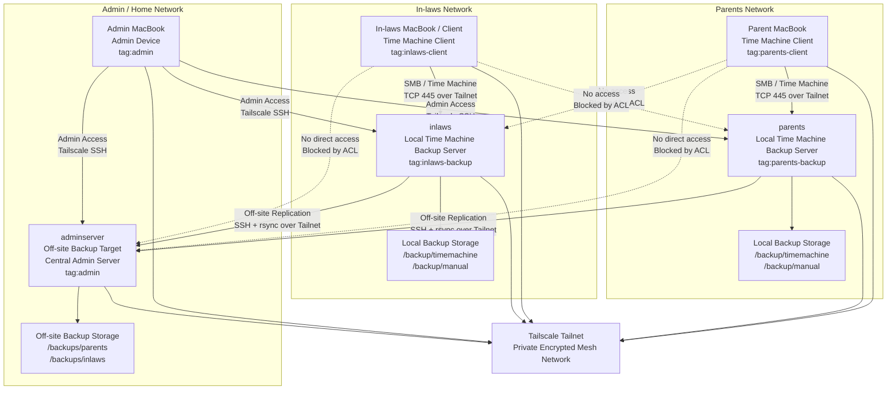

```mermaid
flowchart TB
    subgraph Admin["Admin / Home Network"]
        AdminMac["Admin MacBook\nAdmin Device\ntag:admin"]
        AdminServer["adminserver\nOff-site Backup Target\nCentral Admin Server\ntag:admin"]
        AdminStorage["Off-site Backup Storage\n/backups/parents\n/backups/inlaws"]
    end

    subgraph Parents["Parents Network"]
        ParentClient["Parent MacBook\nTime Machine Client\ntag:parents-client"]
        ParentsBackup["parents\nLocal Time Machine Backup Server\ntag:parents-backup"]
        ParentStorage["Local Backup Storage\n/backup/timemachine\n/backup/manual"]
    end

    subgraph Inlaws["In-laws Network"]
        InlawsClient["In-laws MacBook / Client\nTime Machine Client\ntag:inlaws-client"]
        InlawsBackup["inlaws\nLocal Time Machine Backup Server\ntag:inlaws-backup"]
        InlawsStorage["Local Backup Storage\n/backup/timemachine\n/backup/manual"]
    end

    Tailnet["Tailscale Tailnet\nPrivate Encrypted Mesh Network"]

    AdminMac --> Tailnet
    AdminServer --> Tailnet
    ParentClient --> Tailnet
    ParentsBackup --> Tailnet
    InlawsClient --> Tailnet
    InlawsBackup --> Tailnet

    ParentClient -- "SMB / Time Machine\nTCP 445 over Tailnet" --> ParentsBackup
    InlawsClient -- "SMB / Time Machine\nTCP 445 over Tailnet" --> InlawsBackup

    ParentsBackup --> ParentStorage
    InlawsBackup --> InlawsStorage
    AdminServer --> AdminStorage

    ParentsBackup -- "Off-site Replication\nSSH + rsync over Tailnet" --> AdminServer
    InlawsBackup -- "Off-site Replication\nSSH + rsync over Tailnet" --> AdminServer

    AdminMac -- "Admin Access\nTailscale SSH" --> AdminServer
    AdminMac -- "Admin Access\nTailscale SSH" --> ParentsBackup
    AdminMac -- "Admin Access\nTailscale SSH" --> InlawsBackup

    ParentClient -. "No direct access\nBlocked by ACL" .-> AdminServer
    ParentClient -. "No access\nBlocked by ACL" .-> InlawsBackup
    InlawsClient -. "No access\nBlocked by ACL" .-> ParentsBackup
    InlawsClient -. "No direct access\nBlocked by ACL" .-> AdminServer
```
